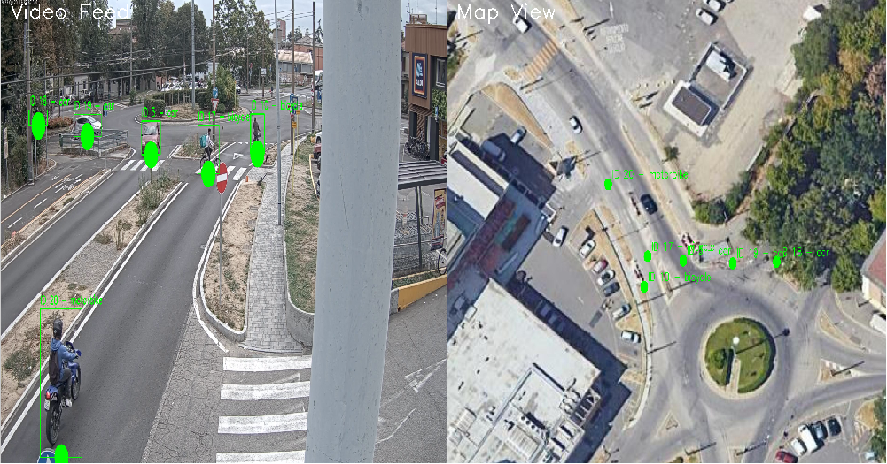

# MASA Video Tracker

This repository contains a python only implementation of object detection (YOLO) and tracking (DeepSORT, ByteTrack, BotSORT, Kalman) for MASA cameras.

It basically contains two main programs:
 * **calibration/findHmography.py** is used to calibrate cameras and move from pixel coordinates to GPS coordinates.
 * **main.py** is the actual code processing video feed and running object detection + tracking + coordinate transformation (homography)

## Calibration

See specific documentation:
- [Calibration User Guide](docs/calibration/README_homography.md) - Guide for using calibration
- [QGIS User Guide](docs/calibration/README_qgis.md) - Guide for using QGIS to obtain map jgw and jpeg images
- [Modena camera location]

## Main Tracker

### How to run it

```bash
python3 main.py -camera 20936 -bytetrack -gui -save
```

### Arguments

**General:**
- `-camera [cam_id]` - Camera ID number
- `-rtsp [url]` - RTSP stream URL (if not specified, uses video file from `videos/` folder)
- `-gui` - Enable GUI visualization (split-screen: video | map)
- `-duration [seconds]` - Processing duration in seconds (default: 30, use 0 for infinite)
- `-save` - Save performance plots to session folder after processing
- `-no-plots` - Skip plot generation at the end (only save CSV data)
- `-yolo_model_path [path]` - Path to YOLO model (default: `trained_models/yolov8m-tuned.pt`)
- `-deepsort_model_path [path]` - Path to DeepSORT ReID model (default: `trained_models/mars-small128.pb`)

**Tracking algorithms:**
- `-deepsort` - Use DeepSORT tracking (Deep Learning ReID + Kalman + Hungarian matching)
- `-kalman` - Use Kalman-only tracking (faster alternative, motion-based only)
- `-bytetrack` - Use ByteTrack tracking (YOLOv8 built-in, robust to occlusions)
- `-botsort` - Use BotSORT tracking (YOLOv8 built-in, ByteTrack + ReID + camera motion compensation)

### Examples

```
# ByteTrack with GUI and plots
python3 main.py -camera 20936 -bytetrack -gui -save

# DeepSORT with RTSP stream, 5 minutes duration
python3 main.py -camera 637 -rtsp rtsp://172.25.0.5:8554/c637 -deepsort -duration 300

# Fast processing: no GUI, no plots, only save CSV data
python3 main.py -camera 20936 -bytetrack -duration 600 -no-plots
```

## Output

### 1. Session Directory Structure

Each run creates a timestamped session directory in `results/`:

## Architecture

The project is organized into modular components:

- `main.py` - Main tracking loop and video processing
- `session_manager.py` - Handles CSV logging and session directory management
- `plot_metrics.py` - Performance visualization and plotting
- `regenerate_plots.py` - Standalone script to regenerate plots from CSV
- `calibration/` - Camera calibration tools
- `*_utils.py` - Wrapper classes for different tracking algorithms

## Extra Documentation

- [KalmanWrapper Usage Guide](docs/KalmanWrapper_Guide.md) - Guide for using Kalman-only tracking (faster alternative to DeepSORT)