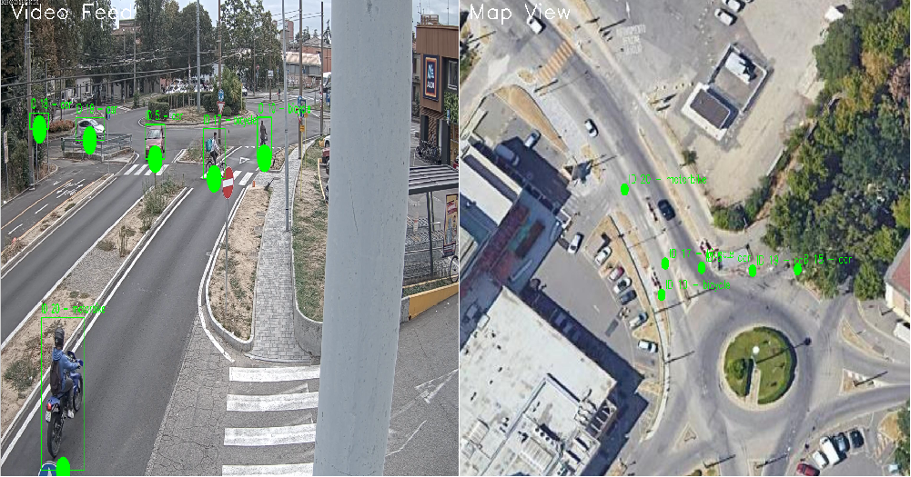

# MASA Video Tracker
## Architecture & IoT Data Flow
The project follows an **Edge-Computing** architecture where video processing occurs near the source, and only metadata is dispatched via MQTT.

1. **Edge Node:** `main.py` runs YOLOv8 + Tracking and applies Homography.
2. **Data Serialization:** Metadata is packed using **MessagePack** for network efficiency.
3. **Transport Layer:** **MQTT (Mosquitto)** protocol handles real-time data distribution.
4. **Components:**
   - `main.py`: Core logic for detection, tracking, and georeferencing.
   - `session_manager.py`: Handles CSV logging and local data persistence.
   - `mqtt_manager.py`: Manages the connection and publishing to the MASA ecosystem.
   
## Smart Object Modeling (Metadata)
To ensure scalability and privacy, the system models detected vehicles as IoT Smart Objects. Each MQTT message contains:
- `track_id`: Unique identifier for the vehicle.
- `cls`: Object class (car, motorcycle, etc.).
- `lat/lon`: Precise GPS coordinates derived from homography.
- `t_detection`: Timestamp of the detection for latency analysis.

## Calibration
This module is the core of the georeferencing system. It allows the translation of detected bounding boxes into precise GPS locations.

### Workflow:
1. **Mapping:** Identify Ground Control Points (GCPs) using **QGIS**.
2. **Matrix Calculation:** Run `findHomography.py` to correlate image pixels with map coordinates.
3. **Validation:** The resulting matrix is stored in `calibration/` and loaded by `main.py` during execution.

### Specific documentation:
- [Calibration User Guide](docs/calibration/README_homography.md) - Detailed guide for calculating the H matrix.
- [QGIS User Guide](docs/calibration/README_qgis.md) - How to extract geographic metadata (.jgw).

## # Main Tracker

The **Main Tracker** is the core engine of the system, responsible for transforming raw video streams into structured, georeferenced metadata for the Smart City ecosystem.

### Processing Pipeline
The system processes each frame through a real-time pipeline:
1. **Detection:** Object identification using **YOLOv8**.
2. **Tracking:** Temporal data association (DeepSORT, ByteTrack, etc.) to ensure consistent vehicle IDs.
3. **Georeferencing:** Pixel-to-GPS projection (**Lat/Lon**) via a custom Homography matrix.
4. **IoT Streaming:** Data serialization (MessagePack) and publishing via **MQTT** to the MASA broker.

### How to Run It
The tracker offers two interaction modes to suit different deployment scenarios:

#### 1. Graphical User Interface (GUI) Mode
Ideal for debugging or users who prefer a visual configuration. Simply run the script without arguments:
```bash
python3 main.py 
```
#### 2. Command Line Interface (CLI) Mode
```bash
python3 main.py -camera 20936 -bytetrack -gui -save
```


## MQTT Integration & IoT Data Networking
A core contribution of this project is the transformation of a standard camera into an **IoT Edge Sensor**. The system is designed to transmit georeferenced metadata instead of raw video streams, ensuring a **Privacy-by-Design** approach and optimizing network bandwidth within the MASA infrastructure.

### IoT Architecture
The system utilizes a **Publisher-Subscriber** model based on the **MQTT** protocol:
* **Edge Node (Publisher):** The Main Tracker processes video locally and publishes structured data.
* **Broker:** A **Mosquitto** instance manages real-time message distribution.
* **Data Consumers (Subscribers):** Remote databases, urban monitoring dashboards, or traffic analysis tools.

### Metadata Modeling & Serialization
To ensure high-speed transmission and minimal latency, the system serializes data using **MessagePack**. This binary format significantly reduces the payload size compared to plain JSON, making it ideal for real-time Smart City applications.

**Smart Object Data Structure:**
Each message published to the broker contains the following georeferenced attributes:
- `track_id`: Unique persistent identifier for the vehicle.
- `cls`: Object classification (e.g., car, motorcycle, truck).
- `lat` / `lon`: High-precision GPS coordinates calculated via Homography.
- `t_detection`: Precise timestamp of the detection.
- `confidence`: The reliability score of the AI model.

### Communication Setup
The tracker is configured to connect to the MASA broker. To monitor the live data stream for validation purposes, use the following command:

```bash
# Start the local Mosquitto broker
net start mosquitto
```
### Transmission Reliability & Resilience (QoS, LWT, Health)
To ensure robust communication within the MASA infrastructure, the system implements a tiered reliability strategy using advanced MQTT features:

**Granular QoS Levels:**
    * **QoS 0 (At Most Once):** Used for high-frequency telemetry where maximum throughput is required and occasional data loss is acceptable.
    * **QoS 1 (At Least Once):** The standard for vehicle detections, ensuring every georeferenced object reaches the broker via acknowledgment handshakes.
    * **QoS 2 (Exactly Once):** Reserved for critical events or control signals (e.g., system configuration changes) where delivery is guaranteed and message duplication must be strictly avoided.

**LWT (Last Will and Testament):** The system registers a "Last Will" message with the broker. In the event of an ungraceful disconnection (e.g., power failure or hardware crash), the broker automatically publishes an "OFFLINE" status to the topic `masa/health/[cam_id]`, ensuring immediate awareness of sensor failure.

**Health Monitoring:** The Edge Node periodically publishes a **Health Heartbeat**. This payload includes diagnostic data such as pipeline latency and hardware status, allowing for real-time monitoring of the sensor's operational integrity.

### Performance Optimization
**Asynchronous Networking:** The MQTT client operates on a dedicated thread, ensuring that network handshakes (especially for QoS 1 and 2) do not introduce bottlenecks in the Computer Vision pipeline.
**Efficient Serialization:** Uses **MessagePack** to compress payloads, reducing the network footprint by 30-50% compared to standard JSON.


### Arguments
**General:**
- `-camera [cam_id]` - Camera ID number
- `-rtsp [url]` - RTSP stream URL (if not specified, uses video file from `videos/` folder)
- `-gui` - Enable GUI visualization (split-screen: video | map)
- `-duration [seconds]` - Processing duration in seconds (default: 30, use 0 for infinite)
- `-save` - Save performance plots to session folder after processing
- `-no-plots` - Skip plot generation at the end (only save CSV data)
- `-yolo_model_path [path]` - Path to YOLO model (default: `trained_models/yolov8m-tuned.pt`)
- `-deepsort_model_path [path]` - Path to DeepSORT ReID model (default: `trained_models/mars-small128.pb`)

**Tracking algorithms:**
- `-deepsort` - Use DeepSORT tracking (Deep Learning ReID + Kalman + Hungarian matching)
- `-kalman` - Use Kalman-only tracking (faster alternative, motion-based only)
- `-bytetrack` - Use ByteTrack tracking (YOLOv8 built-in, robust to occlusions)
- `-botsort` - Use BotSORT tracking (YOLOv8 built-in, ByteTrack + ReID + camera motion compensation)

### Examples

# ByteTrack with GUI and plots
python3 main.py -camera 20936 -bytetrack -gui -save

# DeepSORT with RTSP stream, 5 minutes duration
python3 main.py -camera 637 -rtsp rtsp://172.25.0.5:8554/c637 -deepsort -duration 300

# Fast processing: no GUI, no plots, only save CSV data
python3 main.py -camera 20936 -bytetrack -duration 600 -no-plots
```

## # Output & Data Persistence
At the conclusion of each monitoring session, the system organizes all generated data into a timestamped directory located in `results/SESSION_YYYYMMDD_HHMMSS/`. This structured output is designed to support post-run analysis and scientific validation of the tracking performance.

### 1. Structured Metadata (CSV)
The system logs raw data into CSV files, enabling easy integration with data analysis tools like Pandas, Excel, or MATLAB:
- **`detections.csv`**: A complete record of every tracked object, including persistent Track IDs, object classes, and high-precision GPS (Lat/Lon) coordinates.
- **`traffic_metrics.csv`**: Aggregated data such as total vehicle counts, class distribution, and flow statistics.
- **`telemetry_logs.csv`**: Detailed logs of system performance, including FPS stability and MQTT transmission latencies.

### 2. Automated Performance Analytics
If the `-save` flag is enabled, the system generates a suite of plots to visualize the session results:
* **Trajectory Mapping:** A 2D spatial visualization of vehicle paths projected onto the georeferenced urban map to identify flow patterns.
* **Tracking Stability (ID Persistence):** A chart quantifying "ID Switches" and track fragmentation, serving as a key metric for tracking accuracy.
* **Pipeline Latency:** A temporal analysis of the time taken for Detection, Tracking, and MQTT publishing, proving the system's real-time reliability.
* **Class Distribution:** A categorical breakdown of the detected traffic (e.g., car, motorcycle, truck, bus).

### 3. Session Reproducibility
To ensure the scientific integrity of the data, each results folder includes:
- A copy of the **Camera Calibration** (Homography matrix) used during the session.
- The **Session Configuration**, allowing researchers to reproduce the exact setup for further verification.
